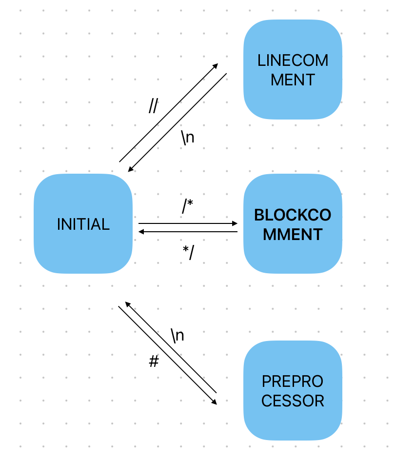

# 词法分析程序的设计与实现--工具生成实验报告  

## 作者：郭栩源

## 一、实验题目要求
本实验要求使用词法分析器生成工具lex完成一个词法分析器，具体要求如下：    
1. 选定源语言，比如：C、Pascal、Python、Java等，任何一种语言均可；  
2. 可以识别出用源语言编写的源程序中的每个单词符号，并以记号的形式输出每个单词符号。  
3. 可以识别并跳过源程序中的注释。  
4. 可以统计源程序中的语句行数、各类单词的个数、以及字符总数，并输出统计结果。  
5. 检查源程序中存在的词法错误，并报告错误所在的位置。  
6. 对源程序中出现的错误进行适当的恢复，使词法分析可以继续进行，对源程序进行一次扫描，即可检查并报告源程序中存在的所有词法错误。

本人使用C语言作为词法分析的原语言，开发环境为macOS 13.0。

## 二、工具介绍
本实验主要涉及到的工具有lex和yacc，下面对其进行介绍：
1. Lex (词法分析器生成工具)
- 作用：Lex 是一个用于生成词法分析器（或称为扫描器）的工具。词法分析器的任务是将输入的字符流转换为一系列的词法单元或标记。
- 输入：Lex 通常需要一个定义了输入字符模式的规范文件。
- 输出：Lex 生成的输出是一个C语言源代码文件，该文件可以编译和链接以生成实际的词法分析器程序。

2. Yacc (Yet Another Compiler Compiler)
- 作用：Yacc 是一个生成语法分析器的工具。与词法分析器不同，语法分析器处理的是词法单元，并且根据某种给定的语法结构组织它们。
- 输入：Yacc 通常需要一个定义了语法规则的规范文件。
- 输出：与 Lex 类似，Yacc 的输出是一个C语言源代码文件。这个文件可以被编译和链接，以生成实际的语法分析器程序。

在编译器的前端，Lex 和 Yacc 经常一起使用。Lex 负责词法分析，产生一系列的词法单元或标记；而 Yacc 则处理这些标记，并根据给定的语法规则组织它们。这两个工具合起来，可以帮助开发者构建一个完整的编译器或解释器的前端部分。  
需要注意的是，在本次实验中我们只需要完成词法分析，因此不会涉及到太多有关yacc的内容，但为了与后续的语法分析相衔接，我们仍会用到Yacc中定义的yylval等。  
yylval是从词法分析器（由Lex生成）到语法分析器（由Yacc生成）的通信桥梁。当词法分析器识别出一个标记（token）时，它可以使用yylval来存储该标记的语义值。随后，当语法分析器请求一个新的标记并调用词法分析器时，语法分析器可以检查yylval来获取该标记的语义值。

## 三、程序设计说明
### 词法分析程序中涉及的记号介绍
1. keyword（关键字）  
   本次实验我选取了ANCI C标准中的32个保留字，分别为：  
   short、int、long、double、float、unsigned、signed、char、typedef、sizeof、struct、enum、union、const、volatile、auto、register、static、extern、if、else、switch、case、default、for、do、while、continue、break、void、return、goto。
2. number（数字常量）  
   包括十进制整数，如：123，  
   十进制浮点数，如12.34，  
   十进制指数，如2.5E3，  
   八进制整数，如017  
   和十六进制整数，如0x4A。  
3. char（字符常量）  
   格式为一对单引号包括着的一个字符，包括转义字符，如'A'和'\n'。
4. string（字符串常量）  
   格式为一对双引号包括着的任意多字符，包括转义字符，如"Hello,world!"。
5. identifier（标识符）  
   C语言中的标识符只能由字母、数字和下划线组成，且第一个字符必须是字母或下划线。
6. operator（操作符）  
   包括：
   算术操作符：+、-、*、/、%++、--。  
   赋值运算符：=。  
   比较运算符：<、<=、>、>=、==、!=。  
   逻辑运算符：&&、||、!。  
   位运算符：&、|、~、^、<<、>>。  
   条件运算符：?、:。  
7. delimiter（分隔符）  
   包括：;、,、.、(、)、[、]、{、}。

### 程序中使用到的全局变量介绍
| 全局变量 | 说明 | 备注 |
| :----:| :----: | :----: |
| lines | 程序行数 | - |
| chars_last_line | 截止到上一行，一共有多少字符 | 用于计算正在处理的记号在程序中的位置 |
| characters | 程序字符总数 | - |
| keywords | 关键字（保留字）总数 | - |
| numbers | 数字常量总数 | - |
| chars | 字符常量总数 | - |
| strings | 字符串常量总数 | - |
| ids | 标识符总数 | - |
| operators | 操作符总数 | - |
| delimiters | 分隔符总数 | - |
| yyin | 输入文件指针 | 定义在lex中，使用lex时自动生成，默认为控制台输入 |
| yyout | 输出文件指针 | 定义在lex中，使用lex时自动生成，默认为控制台输出 |
| yytext | 存储识别的文本 | 定义在lex中，使用lex时自动生成 |
| yyleng | yytext中的字符串长度 | 定义在lex中，使用lex时自动生成 |

### 程序中定义的正则式
| 正则式 | 说明 |
| :----:| :----: |
| keyword | 所有关键字（保留字） |
| delem | 空格（包括制表符） |
| ws | 空白，在词法分析中被忽略 |
| digit | 十进制数字字符 |
| oct_digit | 八进制数字字符 |
| hex_digit | 十六进制数字字符 |
| oct_num | 八进制整数 |
| hex_num | 十六进制整数 |
| num | 十进制整数、浮点数和指数 |
| letter | 字母（包括下划线） |
| escape | C语言转译字符 |
| char | 字符常量 |
| string | 字符串常量 |
| id | 标识符 |
| op | 操作符 |
| delimiter | 分隔符 |

### 识别并跳过注释和预处理器指令
在lex中提供了一种状态机制，允许用户定义在特定上下文中应该如何解析输入。我们使用lex的状态机制来处理C语言中的注释和预处理器指令。  
INITIAL状态为默认状态，在此状态下我们读取源程序中的记号并进行词法分析。  
在INITIAL状态下，读到"//"进入LINECOMMENT状态，处理行注释。在LINECOMMENT状态下读取的一切字符都被忽略，直到读到"\n"返回INITIAL状态。  
在INITIAL状态下，读到"/\*"进入BLOCKCOMMENT状态，处理块注释。在BLOCKCOMMENT状态下读取的一切字符都被忽略，直到读到"\*/"返回INITIAL状态。  
在INITIAL状态下，读到"#"进入PREPROCESSOR状态，处理预处理器指令。在PREPROCESSOR状态下读取的一切字符都被忽略，直到读到"\n"返回INITIAL状态。  
状态转移图如下：  
  

### 统计源程序中的语句行数、各类单词的个数、以及字符总数
在lex程序的翻译规则部分对语句行数、各类单词的个数、以及字符总数进行统计，统计规则如下：  
1. 每种类型的符号出现时，该类型符号数量加1，同时字符总数加上yyleng。
2. 读到\n（换行符）时，行数加1，同时更新chars_last_line为characters。

统计的信息会在输出out文件时使用，以输出每个记号在源文件中所在的位置（行：列）。同时，在out文件末尾会输出全部统计信息。  

### 错误检测与错误恢复
在lex中，我们定义默认规则或特定的不合法规则以实现错误检测和错误恢复。  
lex中的默认规则是指，当没有其他规则匹配时，这个默认规则会匹配，这可以用于捕获和报告词法错误。  
特定的不合法规则是指，检测特定的正则式以识别词法错误，如识别以数字开头的非法标识符可定义正则式{digit}({letter}|{digit})*。  
当遇到无法识别的输入或非法输入时，lex程序调用errorStore函数，将本次错误存储在一个全局的错误链表中。然后尝试继续词法分析，希望从错误中恢复并继续解析文件的其余部分。  
在词法分析结束时，将从错误链表中打印源程序中存在的所有词法错误。

## 四、测试报告
### 测试样例1

    #include <stdio.h>
    #include <string.h>

    int main() {
        // Variable declarations
        double a = 5E-10;
        int b = 0x5A;
        char c = 'a';
        float d = 4.5;
        char str1[] = "Hello, ";
        char str2[] = "World!";
        char result[50]; // to store concatenated string

        // Arithmetic operations
        double sum = a + b;
        double diff = a - b;

        // String operation: concatenation
        strcpy(result, str1);
        strcat(result, str2);

        // Print result
        printf("Concatenated String: %s\n", result);

        return 0;
    }

说明：该样例包括一些基本的四则运算和字符串处理，用于测试一些简单的情况。  
测试输出：  

    [LOCATION] 4:1
    [TYPE] KEYWORD, [VALUE] int

    [LOCATION] 4:4
    [TYPE] ID, [VALUE] main

    [LOCATION] 4:8
    [TYPE] DELIMITER, [VALUE] (

    [LOCATION] 4:9
    [TYPE] DELIMITER, [VALUE] )

    [LOCATION] 4:10
    [TYPE] DELIMITER, [VALUE] {

    [LOCATION] 6:1
    [TYPE] KEYWORD, [VALUE] double

    [LOCATION] 6:7
    [TYPE] ID, [VALUE] a

    [LOCATION] 6:8
    [TYPE] OPERATOR, [VALUE] =

    [LOCATION] 6:9
    [TYPE] NUMBER, [VALUE] 5E-10

    [LOCATION] 6:14
    [TYPE] DELIMITER, [VALUE] ;

    [LOCATION] 7:1
    [TYPE] KEYWORD, [VALUE] int

    [LOCATION] 7:4
    [TYPE] ID, [VALUE] b

    [LOCATION] 7:5
    [TYPE] OPERATOR, [VALUE] =

    [LOCATION] 7:6
    [TYPE] NUMBER, [VALUE] 0x5A

    [LOCATION] 7:10
    [TYPE] DELIMITER, [VALUE] ;

    [LOCATION] 8:1
    [TYPE] KEYWORD, [VALUE] char

    [LOCATION] 8:5
    [TYPE] ID, [VALUE] c

    [LOCATION] 8:6
    [TYPE] OPERATOR, [VALUE] =

    [LOCATION] 8:8
    [TYPE] CHAR, [VALUE] 'a'

    [LOCATION] 8:11
    [TYPE] DELIMITER, [VALUE] ;

    [LOCATION] 9:1
    [TYPE] KEYWORD, [VALUE] float

    [LOCATION] 9:6
    [TYPE] ID, [VALUE] d

    [LOCATION] 9:7
    [TYPE] OPERATOR, [VALUE] =

    [LOCATION] 9:8
    [TYPE] NUMBER, [VALUE] 4.5

    [LOCATION] 9:11
    [TYPE] DELIMITER, [VALUE] ;

    [LOCATION] 10:1
    [TYPE] KEYWORD, [VALUE] char

    [LOCATION] 10:5
    [TYPE] ID, [VALUE] str1

    [LOCATION] 10:9
    [TYPE] DELIMITER, [VALUE] [

    [LOCATION] 10:10
    [TYPE] DELIMITER, [VALUE] ]

    [LOCATION] 10:11
    [TYPE] OPERATOR, [VALUE] =

    [LOCATION] 10:12
    [TYPE] STRING, [VALUE] "Hello, "

    [LOCATION] 10:21
    [TYPE] DELIMITER, [VALUE] ;

    [LOCATION] 11:1
    [TYPE] KEYWORD, [VALUE] char

    [LOCATION] 11:5
    [TYPE] ID, [VALUE] str2

    [LOCATION] 11:9
    [TYPE] DELIMITER, [VALUE] [

    [LOCATION] 11:10
    [TYPE] DELIMITER, [VALUE] ]

    [LOCATION] 11:11
    [TYPE] OPERATOR, [VALUE] =

    [LOCATION] 11:12
    [TYPE] STRING, [VALUE] "World!"

    [LOCATION] 11:20
    [TYPE] DELIMITER, [VALUE] ;

    [LOCATION] 12:1
    [TYPE] KEYWORD, [VALUE] char

    [LOCATION] 12:5
    [TYPE] ID, [VALUE] result

    [LOCATION] 12:11
    [TYPE] DELIMITER, [VALUE] [

    [LOCATION] 12:12
    [TYPE] NUMBER, [VALUE] 50

    [LOCATION] 12:14
    [TYPE] DELIMITER, [VALUE] ]

    [LOCATION] 12:15
    [TYPE] DELIMITER, [VALUE] ;

    [LOCATION] 15:1
    [TYPE] KEYWORD, [VALUE] double

    [LOCATION] 15:7
    [TYPE] ID, [VALUE] sum

    [LOCATION] 15:10
    [TYPE] OPERATOR, [VALUE] =

    [LOCATION] 15:11
    [TYPE] ID, [VALUE] a

    [LOCATION] 15:12
    [TYPE] OPERATOR, [VALUE] +

    [LOCATION] 15:13
    [TYPE] ID, [VALUE] b

    [LOCATION] 15:14
    [TYPE] DELIMITER, [VALUE] ;

    [LOCATION] 16:1
    [TYPE] KEYWORD, [VALUE] double

    [LOCATION] 16:7
    [TYPE] ID, [VALUE] diff

    [LOCATION] 16:11
    [TYPE] OPERATOR, [VALUE] =

    [LOCATION] 16:12
    [TYPE] ID, [VALUE] a

    [LOCATION] 16:13
    [TYPE] OPERATOR, [VALUE] -

    [LOCATION] 16:14
    [TYPE] ID, [VALUE] b

    [LOCATION] 16:15
    [TYPE] DELIMITER, [VALUE] ;

    [LOCATION] 19:1
    [TYPE] ID, [VALUE] strcpy

    [LOCATION] 19:7
    [TYPE] DELIMITER, [VALUE] (

    [LOCATION] 19:8
    [TYPE] ID, [VALUE] result

    [LOCATION] 19:14
    [TYPE] DELIMITER, [VALUE] ,

    [LOCATION] 19:15
    [TYPE] ID, [VALUE] str1

    [LOCATION] 19:19
    [TYPE] DELIMITER, [VALUE] )

    [LOCATION] 19:20
    [TYPE] DELIMITER, [VALUE] ;

    [LOCATION] 20:1
    [TYPE] ID, [VALUE] strcat

    [LOCATION] 20:7
    [TYPE] DELIMITER, [VALUE] (

    [LOCATION] 20:8
    [TYPE] ID, [VALUE] result

    [LOCATION] 20:14
    [TYPE] DELIMITER, [VALUE] ,

    [LOCATION] 20:15
    [TYPE] ID, [VALUE] str2

    [LOCATION] 20:19
    [TYPE] DELIMITER, [VALUE] )

    [LOCATION] 20:20
    [TYPE] DELIMITER, [VALUE] ;

    [LOCATION] 23:1
    [TYPE] ID, [VALUE] printf

    [LOCATION] 23:7
    [TYPE] DELIMITER, [VALUE] (

    [LOCATION] 23:8
    [TYPE] STRING, [VALUE] "Concatenated String: %s\n"

    [LOCATION] 23:35
    [TYPE] DELIMITER, [VALUE] ,

    [LOCATION] 23:36
    [TYPE] ID, [VALUE] result

    [LOCATION] 23:42
    [TYPE] DELIMITER, [VALUE] )

    [LOCATION] 23:43
    [TYPE] DELIMITER, [VALUE] ;

    [LOCATION] 25:1
    [TYPE] KEYWORD, [VALUE] return

    [LOCATION] 25:7
    [TYPE] NUMBER, [VALUE] 0

    [LOCATION] 25:8
    [TYPE] DELIMITER, [VALUE] ;

    [LOCATION] 26:1
    [TYPE] DELIMITER, [VALUE] }

    ===========Analysis==========
        [Rows] 25
        [Characters] 233
        [Keyword] 11
        [Number] 5
        [Character Constant] 0
        [String Literal] 3
        [Operator] 22
        [Delimiter] 10
        [Identifier] 32

经检测，由此lex程序生成的词法分析程序具有基础的词法分析功能。  

### 测试样例2

    #include <stdio.h>

    int main() {

        // 以下是一些词法错误
        int 12y = 10;  // 变量名不能以数字开始    
        $printf("Hello world");  // '$' 是一个无法识别的字符

        return 0;
    }

说明：该样例包括一些简单的词法错误，以检测词法分析程序错误处理的能力。  
测试输出：  

    [LOCATION] 3:1
    [TYPE] KEYWORD, [VALUE] int

    [LOCATION] 3:4
    [TYPE] ID, [VALUE] main

    [LOCATION] 3:8
    [TYPE] DELIMITER, [VALUE] (

    [LOCATION] 3:9
    [TYPE] DELIMITER, [VALUE] )

    [LOCATION] 3:10
    [TYPE] DELIMITER, [VALUE] {

    [LOCATION] 6:1
    [TYPE] KEYWORD, [VALUE] int

    [LOCATION] 6:4
    [TYPE] ILLEGAL_ID, [VALUE] 12y

    [LOCATION] 6:7
    [TYPE] OPERATOR, [VALUE] =

    [LOCATION] 6:8
    [TYPE] NUMBER, [VALUE] 10

    [LOCATION] 6:10
    [TYPE] DELIMITER, [VALUE] ;

    [LOCATION] 7:11
    [TYPE] UNKNOWN, [VALUE] $

    [LOCATION] 7:12
    [TYPE] ID, [VALUE] printf

    [LOCATION] 7:18
    [TYPE] DELIMITER, [VALUE] (

    [LOCATION] 7:19
    [TYPE] STRING, [VALUE] "Hello world"

    [LOCATION] 7:32
    [TYPE] DELIMITER, [VALUE] )

    [LOCATION] 7:33
    [TYPE] DELIMITER, [VALUE] ;

    [LOCATION] 9:1
    [TYPE] KEYWORD, [VALUE] return

    [LOCATION] 9:7
    [TYPE] NUMBER, [VALUE] 0

    [LOCATION] 9:8
    [TYPE] DELIMITER, [VALUE] ;

    [LOCATION] 10:1
    [TYPE] DELIMITER, [VALUE] }

    ===========Analysis==========
        [Rows] 10
        [Characters] 52
        [Keyword] 3
        [Number] 2
        [Character Constant] 0
        [String Literal] 1
        [Operator] 2
        [Delimiter] 1
        [Identifier] 9
        [ERRORS]
    !!!ERROR AT 6:4!!!    
    !!!ERROR AT 7:11!!!    

经检测，该lex词法分析程序具有一定的错误检测和恢复能力。

## 五、改进与完善
由于本人是第一次接触lex工具，对lex工具的使用还并不是很熟练，因此，此次实验仍有许多可改进之处。  
比如，在定义正则式时，我大量采用了枚举方法，或许还有其他更简易的方式。  
再如，在进行错误检测与错误恢复时，我使用了定义默认规则和不合法规则的方式，这种方式实际上也是“经验式”的，可能无法检测出全部的词法错误。而在手写词法分析程序时，使用自动机的方式能够更加全面有效地进行错误检测和错误恢复。 

## 六、用户手册
在macOS环境下，使用lex lex.l即可编译lex文件，生成lex.yy.c。  
生成lex.yy.c后，使用gcc lex.yy.c -ll对生成的C语言文件进行编译，生成a.out可执行文件。  
使用./a.out in out运行即可，后面的in和out指定了输入输出文件，若省略则默认为控制台输入输出。  
需要注意的是，lex是unix下的词法生成器生成工具，在Windows系统下需要额外安装lex编译环境，此处不再赘述。
