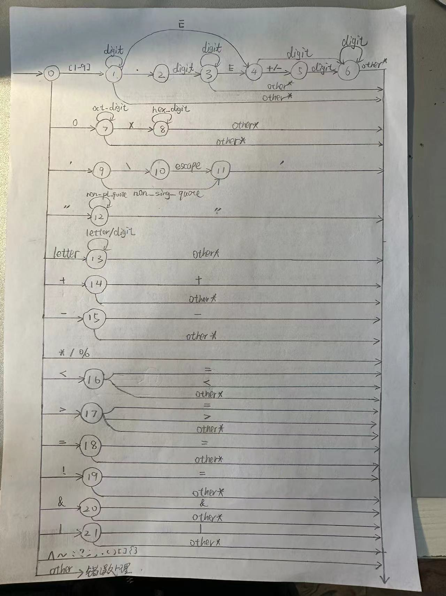
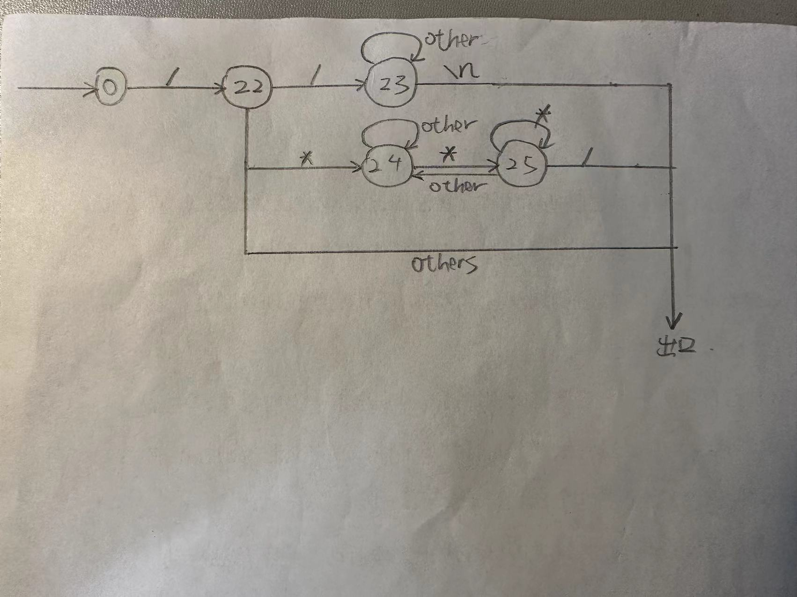

# 词法分析程序的设计与实现--手工编写实验报告  

## 作者：郭栩源

## 一、实验题目要求
本实验要求使用C/C++语言实现一个词法分析器，具体要求如下：    
1. 选定源语言，比如：C、Pascal、Python、Java等，任何一种语言均可；  
2. 可以识别出用源语言编写的源程序中的每个单词符号，并以记号的形式输出每个单词符号。  
3. 可以识别并跳过源程序中的注释。  
4. 可以统计源程序中的语句行数、各类单词的个数、以及字符总数，并输出统计结果。  
5. 检查源程序中存在的词法错误，并报告错误所在的位置。  
6. 对源程序中出现的错误进行适当的恢复，使词法分析可以继续进行，对源程序进行一次扫描，即可检查并报告源程序中存在的所有词法错误。

本人使用C语言作为词法分析的原语言，使用C++语言作为实现语言，开发环境为macOS 13.0。

## 二、程序设计说明
### 词法分析程序中涉及的记号介绍
1. keyword（关键字）  
   本次实验我选取了ANCI C标准中的32个保留字，分别为：  
   short、int、long、double、float、unsigned、signed、char、typedef、sizeof、struct、enum、union、const、volatile、auto、register、static、extern、if、else、switch、case、default、for、do、while、continue、break、void、return、goto。
2. number（数字常量）  
   包括十进制整数，如：123，  
   十进制浮点数，如12.34，  
   十进制指数，如2.5E3，  
   八进制整数，如017  
   和十六进制整数，如0x4A。  
3. char（字符常量）  
   格式为一对单引号包括着的一个字符，包括转义字符，如'A'和'\n'。
4. string（字符串常量）  
   格式为一对双引号包括着的任意多字符，包括转义字符，如"Hello,world!"。
5. identifier（标识符）  
   C语言中的标识符只能由字母、数字和下划线组成，且第一个字符必须是字母或下划线。
6. operator（操作符）  
   包括：
   算术操作符：+、-、*、/、%++、--。  
   赋值运算符：=。  
   比较运算符：<、<=、>、>=、==、!=。  
   逻辑运算符：&&、||、!。  
   位运算符：&、|、~、^、<<、>>。  
   条件运算符：?、:。  
7. delimiter（分隔符）  
   包括：;、,、.、(、)、[、]、{、}。

### 程序中使用到的全局变量和函数介绍
全局变量：  

| 全局变量 | 说明 | 备注 |
| :----:| :----: | :----: |
| state | 有限状态机状态值 | 详见“状态机介绍” |
| iskey | 标识符是否为关键字 | 若是，则为关键字索引，否则为-1 |
| lines | 行数 | 当前行数 |
| cols | 列数 | 当前列数，截至每个标志末尾 |
| cols_copy | 列数的拷贝 | 用于程序回滚时恢复列数 |
| characters | 程序字符总数 | - |
| keywords | 关键字（保留字）总数 | - |
| numbers | 数字常量总数 | - |
| chars | 字符常量总数 | - |
| strings | 字符串常量总数 | - |
| ids | 标识符总数 | - |
| operators | 操作符总数 | - |
| delimiters | 分隔符总数 | - |
| C | 当前字符 | - |
| buffer | 缓冲区 | 具有两个半区，每个半区大小1KB，共2KB |
| token | 当前正在识别的字符串 | - |
| forward | 前向指针 | - |
| keywords_table | 关键字表 | - |
| head | 错误链表表头 | - |

函数：  

| 函数 | 说明 |
| :----:| :----: |
| refresh  | 根据类型刷新缓冲区 |
| get_char | 获取下一个字符 |
| get_nbc | 获取下一个非空白字符 |
| cat | 连接当前字符到token |
| is_digit | 判断是否为数字 |
| is_oct_digit | 判断是否为八进制数字 |
| is_hex_digit | 判断是否为十六进制数字 |
| is_escape | 判断是否为转义字符 |
| is_non_sing_quote | 判断字符是否不为单引号 |
| is_non_pl_quote | 判断字符是否不为双引号 |
| is_letter | 判断是否为字母或下划线 |
| retract | 回退一个字符并更新相应的行列统计 |
| reserve | 检查token是否是关键字 |
| SToI | 将token从字符串形式转换为整数。考虑十进制、十六进制和八进制的情况。 |
| SToF | 将token从字符串形式转换为浮点数 |
| SToE | 将token从科学计数法的字符串形式转换为浮点数 |
| table_insert | 插入表项 |
| error | 错误处理函数 |
| write_out | 输出token的信息到输出文件 |
| printAnalyses | 打印词法分析的统计结果到输出文件 |

### 状态机介绍
首先介绍各符号的生成文法：  
下面的生成式中，digit表示 [0-9]，oct_digit表示 [0-7]，hex_digit表示 [0-9a-fA-F]，non_sing_quote表示 [^'] ，escape表示 \'"?abfnrtv，non_pl_quote表示 [^"]，letter表示 [_a-zA-Z]。  

    num -> [1-9] num1
    num1 -> digit num1 | . num2 | E num4 | epsilon
    num2 -> digit num3
    num3 -> digit num3 | E num4 | epsilon
    num4 -> + digits | - digits | digit num5
    digits -> digit num5
    num5 -> digit num5 | epsilon

    oct_num -> 0 oct_num1
    oct_num1 -> oct_digit oct_num1 | epsilon

    hex_num -> 0 hex_num1
    hex_num1 -> x hex_num2
    hex_num2 -> hex_digit hex_num2 | epsilon

    char -> ' char1
    char1 -> non_sing_quote sing_quote | \ escapes
    escapes -> escape sing_quote
    sing_quote -> '

    string -> " string1
    string1 -> non_pl_quote string1 | "

    id -> letter rid
    rid -> letter rid | digit rid | epsilon

    arithmetic_op -> + | + add_op | - | - sub_op | * | / | %
    add_op -> +
    sub_op -> -

    relational_op -> < | < eq | > | > eq | = eq | ! eq
    eq -> =

    assignment_op -> =

    logical_op -> & and_op | | or_op | !
    and_op -> &
    or_op -> |

    bitwise_op -> & | | | ^ | ~ | < l_bracket | > r_bracket
    l_bracket -> <
    r_bracket -> >

    ternary_op -> : | ?

    delimiter -> ; | , | . | ( | ) | [ | ] | { | }

由生成文法，可简化得到有限状态机如图：  
  
  
其中，第一张状态转移图表示正常处理，第二张状态转移图表示注释处理。  

### 识别并跳过注释
在“状态机介绍”中的第二张状态转移图中我们已经可以知道，识别并跳过注释在该词法分析程序中是靠状态22～状态25来实现的。  
在状态0下读到'/'，进入状态22。状态22的作用是判断刚才的'/'究竟是行注释的开头、块注释的开头还是普通的除法运算符。  
在状态22下读到'/'，进入状态23，处理行注释。在状态23下读到的所有字符都将被忽略，直到读到'\n'，返回状态0。  
在状态22下读到'\*'，进入状态24，处理块注释。在状态24下读到的所有字符都将被忽略，直到读到'\*'，进入状态25。状态25的作用是判断刚才的'\*'究竟是块注释的结束，还是普通星号。在状态25下，读到'\*'，仍停留在状态25，读到'/'，则返回状态0，读到其他所有状态都将使其重新回到状态24。

### 统计源程序中的语句行数、各类单词的个数、以及字符总数
在状态机中对语句行数、各类单词的个数、以及字符总数进行统计，统计规则如下： 

1. 每读取一次字符，字符总数加一，列数加一。
2. 每种类型的符号出现时，该类型符号数量加1。
3. 读到\n（换行符）时，行数加1，同时更新列数为0。
4. 回滚时，有以下两种情况：若回滚前未换行，则列数和字符总数减一即可；若回滚前换行，则行数减一，字符数减一，列数从列数的拷贝中恢复。

统计的信息会在输出out文件时使用，以输出每个记号在源文件中所在的位置（行：列）。同时，在out文件末尾会输出全部统计信息。

### 错误检测与错误恢复
当输入的字符在有限状态自动机中当前状态下没有对应的射出边时，就能够反映一个词法错误。这种错误检测方法比我在lex生成词法分析器中使用的定义默认规则或特定的不合法规则的方法更加全面有效。  
在这个词法分析器下，我大体将错误类型分为四类：  

| 错误类型 | 说明 |
|--|--|
| UNKNOWN | 无法检测的符号，如unicode编码的中文 |
| ILLEGAL_NUM | 非法数字常量，如12a |
| ILLEGAL_CHAR | 非法字符常量，如'cc' |
| ILLEGAL_STRING | 非法字符串常量（引号缺失），如"string |

错误发生后，词法分析器会尝试继续词法分析，希望从错误中恢复并继续解析文件的其余部分。  
对于ILLEGAL_CHAR错误和ILLEGAL_STRING错误，为避免由于缺失引号导致的问题（如后续符号全部被当作字符串内容读入），我们采取如下错误恢复策略：向后不断读取并跳过字符，直到读到另一个对应的引号或换行符。  
同时，当错误发生时，程序调用error函数，将本次错误存储在一个全局的错误链表中。在词法分析结束时，将从错误链表中打印源程序中存在的所有词法错误。  

### 缓冲区的更新
只需要设置yyin和yyout，lex程序会一键帮我们处理好输入和输出，而在手工编写的词法分析器中，我们必须自己设计这些。  
该程序使用一个buffer（缓冲区）。程序开始或缓冲区每次刷新时，会从文件中读取一块字符到缓冲区中。其余情况下，无论是读字符还是回滚，都只在缓冲区中进行。  
在该程序中，缓冲区被设计为拥有两个半区，每个半区大小为1KB，总共2KB。每个半区的结束位置设定为EOF。程序执行时，只要读到EOF就进行判断：若为左半区的结尾，则刷新右半区，并将前向指针移到右半区起始处；若为右半区结尾，则刷新左半区，并将指针移到左半区起始处；如果既不是左半区结尾，也不是右半区结尾，则说明读到了文件结尾的EOF，此时停止词法分析操作。  

## 三、测试报告
### 测试样例1

    int main() {
        // Variable declarations
        double a = 5E-10;
        int b = 0x5A;
        char c = 'a';
        float d = 4.5;
        char str1[] = "Hello, ";
        char str2[] = "World!";
        char result[50]; // to store concatenated string

        // Arithmetic operations
        double sum = a + b;
        double diff = a - b;

        // String operation: concatenation
        strcpy(result, str1);
        strcat(result, str2);

        // Print result
        printf("Concatenated String: %s\n", result);

        return 0;
    }

说明：该样例包括一些基本的四则运算和字符串处理，用于测试一些简单的情况。  
测试输出：  

    [ROW] 1, [COL] 8
    [TYPE] keyword, [VALUE] int

    [ROW] 1, [COL] 13
    [TYPE] id, [VALUE] main

    [ROW] 1, [COL] 14
    [TYPE] delimiter, [VALUE] (

    [ROW] 1, [COL] 15
    [TYPE] delimiter, [VALUE] )

    [ROW] 1, [COL] 17
    [TYPE] delimiter, [VALUE] {

    [ROW] 3, [COL] 16
    [TYPE] keyword, [VALUE] double

    [ROW] 3, [COL] 18
    [TYPE] id, [VALUE] a

    [ROW] 3, [COL] 20
    [TYPE] assignment_op, [VALUE] =

    [ROW] 3, [COL] 22
    [TYPE] num_I, [VALUE] 5

    [ROW] 3, [COL] 23
    [TYPE] id, [VALUE] E

    [ROW] 3, [COL] 24
    [TYPE] arithmetic_op, [VALUE] -

    [ROW] 3, [COL] 26
    [TYPE] num_I, [VALUE] 10

    [ROW] 3, [COL] 27
    [TYPE] delimiter, [VALUE] ;

    [ROW] 4, [COL] 13
    [TYPE] keyword, [VALUE] int

    [ROW] 4, [COL] 15
    [TYPE] id, [VALUE] b

    [ROW] 4, [COL] 17
    [TYPE] assignment_op, [VALUE] =

    [ROW] 4, [COL] 22
    [TYPE] hex_num, [VALUE] 90

    [ROW] 4, [COL] 23
    [TYPE] delimiter, [VALUE] ;

    [ROW] 5, [COL] 14
    [TYPE] keyword, [VALUE] char

    [ROW] 5, [COL] 16
    [TYPE] id, [VALUE] c

    [ROW] 5, [COL] 18
    [TYPE] assignment_op, [VALUE] =

    [ROW] 5, [COL] 22
    [TYPE] char, [VALUE] 'a'

    [ROW] 5, [COL] 23
    [TYPE] delimiter, [VALUE] ;

    [ROW] 6, [COL] 15
    [TYPE] keyword, [VALUE] float

    [ROW] 6, [COL] 17
    [TYPE] id, [VALUE] d

    [ROW] 6, [COL] 19
    [TYPE] assignment_op, [VALUE] =

    [ROW] 6, [COL] 23
    [TYPE] num_F, [VALUE] 4.500000

    [ROW] 6, [COL] 24
    [TYPE] delimiter, [VALUE] ;

    [ROW] 7, [COL] 14
    [TYPE] keyword, [VALUE] char

    [ROW] 7, [COL] 19
    [TYPE] id, [VALUE] str1

    [ROW] 7, [COL] 20
    [TYPE] delimiter, [VALUE] [

    [ROW] 7, [COL] 21
    [TYPE] delimiter, [VALUE] ]

    [ROW] 7, [COL] 23
    [TYPE] assignment_op, [VALUE] =

    [ROW] 7, [COL] 33
    [TYPE] string, [VALUE] "Hello, "

    [ROW] 7, [COL] 34
    [TYPE] delimiter, [VALUE] ;

    [ROW] 8, [COL] 14
    [TYPE] keyword, [VALUE] char

    [ROW] 8, [COL] 19
    [TYPE] id, [VALUE] str2

    [ROW] 8, [COL] 20
    [TYPE] delimiter, [VALUE] [

    [ROW] 8, [COL] 21
    [TYPE] delimiter, [VALUE] ]

    [ROW] 8, [COL] 23
    [TYPE] assignment_op, [VALUE] =

    [ROW] 8, [COL] 32
    [TYPE] string, [VALUE] "World!"

    [ROW] 8, [COL] 33
    [TYPE] delimiter, [VALUE] ;

    [ROW] 9, [COL] 14
    [TYPE] keyword, [VALUE] char

    [ROW] 9, [COL] 21
    [TYPE] id, [VALUE] result

    [ROW] 9, [COL] 22
    [TYPE] delimiter, [VALUE] [

    [ROW] 9, [COL] 24
    [TYPE] num_I, [VALUE] 50

    [ROW] 9, [COL] 25
    [TYPE] delimiter, [VALUE] ]

    [ROW] 9, [COL] 26
    [TYPE] delimiter, [VALUE] ;

    [ROW] 12, [COL] 16
    [TYPE] keyword, [VALUE] double

    [ROW] 12, [COL] 20
    [TYPE] id, [VALUE] sum

    [ROW] 12, [COL] 22
    [TYPE] assignment_op, [VALUE] =

    [ROW] 12, [COL] 24
    [TYPE] id, [VALUE] a

    [ROW] 12, [COL] 26
    [TYPE] arithmetic_op, [VALUE] +

    [ROW] 12, [COL] 28
    [TYPE] id, [VALUE] b

    [ROW] 12, [COL] 29
    [TYPE] delimiter, [VALUE] ;

    [ROW] 13, [COL] 16
    [TYPE] keyword, [VALUE] double

    [ROW] 13, [COL] 21
    [TYPE] id, [VALUE] diff

    [ROW] 13, [COL] 23
    [TYPE] assignment_op, [VALUE] =

    [ROW] 13, [COL] 25
    [TYPE] id, [VALUE] a

    [ROW] 13, [COL] 27
    [TYPE] arithmetic_op, [VALUE] -

    [ROW] 13, [COL] 29
    [TYPE] id, [VALUE] b

    [ROW] 13, [COL] 30
    [TYPE] delimiter, [VALUE] ;

    [ROW] 16, [COL] 16
    [TYPE] id, [VALUE] strcpy

    [ROW] 16, [COL] 17
    [TYPE] delimiter, [VALUE] (

    [ROW] 16, [COL] 23
    [TYPE] id, [VALUE] result

    [ROW] 16, [COL] 24
    [TYPE] delimiter, [VALUE] ,

    [ROW] 16, [COL] 29
    [TYPE] id, [VALUE] str1

    [ROW] 16, [COL] 30
    [TYPE] delimiter, [VALUE] )

    [ROW] 16, [COL] 31
    [TYPE] delimiter, [VALUE] ;

    [ROW] 17, [COL] 16
    [TYPE] id, [VALUE] strcat

    [ROW] 17, [COL] 17
    [TYPE] delimiter, [VALUE] (

    [ROW] 17, [COL] 23
    [TYPE] id, [VALUE] result

    [ROW] 17, [COL] 24
    [TYPE] delimiter, [VALUE] ,

    [ROW] 17, [COL] 29
    [TYPE] id, [VALUE] str2

    [ROW] 17, [COL] 30
    [TYPE] delimiter, [VALUE] )

    [ROW] 17, [COL] 31
    [TYPE] delimiter, [VALUE] ;

    [ROW] 20, [COL] 16
    [TYPE] id, [VALUE] printf

    [ROW] 20, [COL] 17
    [TYPE] delimiter, [VALUE] (

    [ROW] 20, [COL] 44
    [TYPE] string, [VALUE] "Concatenated String: %s\n"

    [ROW] 20, [COL] 45
    [TYPE] delimiter, [VALUE] ,

    [ROW] 20, [COL] 52
    [TYPE] id, [VALUE] result

    [ROW] 20, [COL] 53
    [TYPE] delimiter, [VALUE] )

    [ROW] 20, [COL] 54
    [TYPE] delimiter, [VALUE] ;

    [ROW] 22, [COL] 16
    [TYPE] keyword, [VALUE] return

    [ROW] 22, [COL] 18
    [TYPE] oct_num, [VALUE] 0

    [ROW] 22, [COL] 19
    [TYPE] delimiter, [VALUE] ;

    [ROW] 23, [COL] 7
    [TYPE] delimiter, [VALUE] }

    ===========Analysis==========
        [Rows] 22
        [Characters] 563
        [Keyword] 11
        [Number] 6
        [Character Constant] 1
        [String Literal] 3
        [Operator] 11
        [Delimiter] 32
        [Identifier] 23

可见，此词法分析程序具有基础的词法分析功能。  

### 测试样例2
    
    int main() {

        // 以下是一些词法错误    
        $printf("Hello world");  // '$' 是一个无法识别的字符
        char a='jj';    //错误的字符常量
        char *str="Hello,world!     //没有结尾的字符串

        return 0;
    }

说明：该样例包括一些简单的词法错误，以检测词法分析程序错误处理的能力。    
测试输出：  

    [ROW] 1, [COL] 4
    [TYPE] keyword, [VALUE] int

    [ROW] 1, [COL] 9
    [TYPE] id, [VALUE] main

    [ROW] 1, [COL] 10
    [TYPE] delimiter, [VALUE] (

    [ROW] 1, [COL] 11
    [TYPE] delimiter, [VALUE] )

    [ROW] 1, [COL] 13
    [TYPE] delimiter, [VALUE] {

    [ROW] 4, [COL] 11
    [TYPE] unknown, [VALUE] $

    [ROW] 4, [COL] 17
    [TYPE] id, [VALUE] printf

    [ROW] 4, [COL] 18
    [TYPE] delimiter, [VALUE] (

    [ROW] 4, [COL] 31
    [TYPE] string, [VALUE] "Hello world"

    [ROW] 4, [COL] 32
    [TYPE] delimiter, [VALUE] )

    [ROW] 4, [COL] 33
    [TYPE] delimiter, [VALUE] ;

    [ROW] 5, [COL] 14
    [TYPE] keyword, [VALUE] char

    [ROW] 5, [COL] 16
    [TYPE] id, [VALUE] a

    [ROW] 5, [COL] 17
    [TYPE] assignment_op, [VALUE] =

    [ROW] 5, [COL] 21
    [TYPE] unknown, [VALUE] '

    [ROW] 5, [COL] 22
    [TYPE] delimiter, [VALUE] ;

    [ROW] 6, [COL] 14
    [TYPE] keyword, [VALUE] char

    [ROW] 6, [COL] 16
    [TYPE] arithmetic_op, [VALUE] *

    [ROW] 6, [COL] 19
    [TYPE] id, [VALUE] str

    [ROW] 6, [COL] 20
    [TYPE] assignment_op, [VALUE] =

    [ROW] 7, [COL] 2
    [TYPE] unknown, [VALUE] 

    [ROW] 8, [COL] 16
    [TYPE] keyword, [VALUE] return

    [ROW] 8, [COL] 18
    [TYPE] oct_num, [VALUE] 0

    [ROW] 8, [COL] 19
    [TYPE] delimiter, [VALUE] ;

    [ROW] 9, [COL] 7
    [TYPE] delimiter, [VALUE] }

    ===========Analysis==========
        [Rows] 8
        [Characters] 264
        [Keyword] 4
        [Number] 1
        [Character Constant] 0
        [String Literal] 1
        [Operator] 3
        [Delimiter] 9
        [Identifier] 4
    [ERRORS]
    !!!ERROR AT 4:11!!!    
    EXPLAINATION: Unknown symbol.
    !!!ERROR AT 5:20!!!    
    EXPLAINATION: Illegal character constant.
    !!!ERROR AT 7:2!!!    
    EXPLAINATION: Illegal string literal.

可见，此词法分析程序检测出了全部的三个错误，具有基础的错误检测和错误恢复功能。

### 测试样例3
将词法分析程序本身作为测试样例。  
说明：词法分析程序本身大小远超2KB，用于测试缓冲区刷新功能是否正常。  
测试输出：略。  
经检测，缓冲区刷新功能正常。

## 五、改进与完善
在对比lex生成的词法分析程序和手工编写的程序对同一源程序的输出结果，我发现了一个问题：两个程序对字符总数的统计不一样！原因是lex生成的词法分析程序只统计了非空格的字符总数，而手工编写的词法分析程序的结果包含空格，所以出现了手工编写程序结果两倍多与lex生成程序的情况。在实际使用中，要根据实际情况来确定是否需要统计空格。  
以及，此词法分析程序并没有设计对预处理器指令的处理，因为方法和对注释的处理基本一致，且在lex生成的词法分析程序中已经实现过。