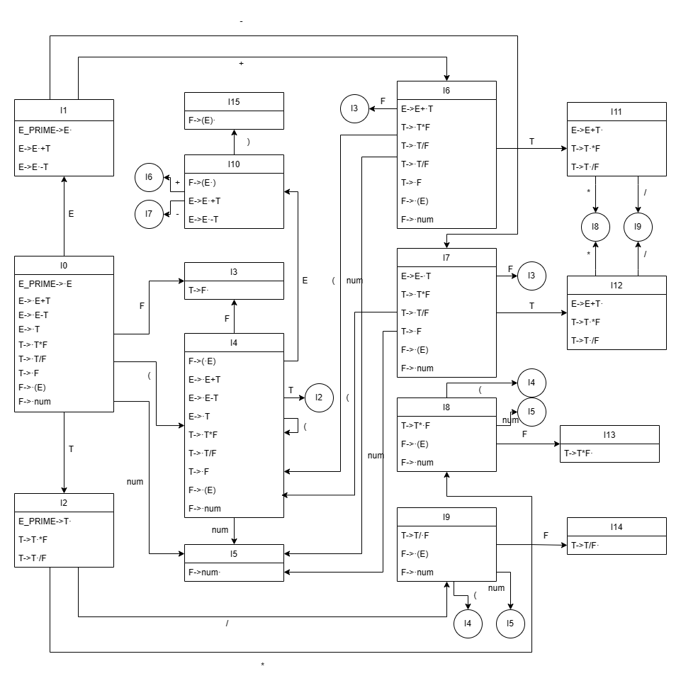

# LL(1)语法分析器——实验报告

作者：郭栩源

## 一、实验题目要求

本次实验要求编写一个LR分析程序，它通过预测分析表进行句子的语法分析。  
要求所分析算数表达式由如下的文法产生：  
E→E+T | E–T | T  
T→T*F | T/F | F  
F→(E) | num  
本人使用C语言实现语法分析器，开发环境为macOS 13.0和Windows 10专业版22H2。  

## 二、程序设计说明

### 前置工作

在进行程序设计之前，首先将源文法改造成拓广文法：
(0) E_PRIME→E  
(1) E→E+T | E–T | T  
(2) T→T*F | T/F | F  
(3) F→(E) | num  
其次，对该文法的每个非终结符求其FIRST和FOLLOW集：  

非终结符|FIRST|FOLLOW
:----:|:----:|:----:
E_PRIME|(,num|$
E|(,num|+,-,),$
T|(,num|*,/,+,-,),$
F|(,num|*,/,+,-,),$

然后，构造该文法的LR(0)项目集规范族和识别该文法所有活前缀的DFA。  
DFA如下图，其中每一个状态蕴含一个项目集规范族：  


结合该文法中每一个元素的FOLLOW集，可知，在每个项目集中，进行移进操作时的输入元素均不出现在规约操作的产生式的左部元素的FOLLOW集中，故该文法中不存在“移进-规约”冲突和“规约-规约”冲突，为SLR(1)文法。  
最后，求该文法的SLR(1)分析表.  
action表：

状态|+|-|*|/|(|)|num|$
:--:|:--:|:--:|:--:|:--:|:--:|:--:|:--:|:--:
I0|e0|e0|e0|e0|s4|e1|s5|e0
I1|s6|s7| | |e2|e1|e2|acc
I2|r3|r3|s8|s9|e2|r3|e2|r3
I3|r6|r6|r6|r6|r6*|r6|r6*|r6
I4|e0|e0|e0|e0|s4|e1|s5|e0
I5|r8|r8|r8|r8|r8*|r8|r8*|r8
I6|e0|e0|e0|e0|s4|e1|s5|e0
I7|e0|e0|e0|e0|s4|e1|s5|e0
I8|e0|e0|e0|e0|s4|e1|s5|e0
I9|e0|e0|e0|e0|s4|e1|s5|e0
I10|s6|s7|e3|e3|e3|s15|e3|e3
I11|r1|r1|s8|s9|e2|r1|e2|r1
I12|r2|r2|s8|s9|e2|r1|e2|r1
I13|r4|r4|r4|r4|r4*|r4|r4*|r4
I14|r5|r5|r5|r5|r5*|r5|r5*|r5
I15|r7|r7|r7|r7|r7*|r7|r7*|r7

此action表中共有三种表项：SHIFT，REDUCE和ERROR。其中SHIFT X表项表示移进并转移到状态X，REDUCE X表示使用编号为X的产生式进行规约，ERROR X表示发生编号为X的错误（X的含义在下文中错误处理部分会详细介绍）。特殊地，带有*号的REDUCE表项表示此项已出错，虽然此处进行规约操作，但是错误仍将在移进下一个输入符号前被捕获。  
此外，表中有两项为空，经手工推导，发现这两项在实际进行语法分析时永远不会出现，故设为空。

goto表：

状态|E|T|F
:--:|:--:|:--:|:--:|
I0|1|2|3
I1|||
I2|||
I3|||
I4|10|2|3
I5
I6||11|3
I7||12|3
I8|||13
I9|||14
I10
I11
I12
I13
I14
I15

goto表只在规约后被调用，根据当前栈顶状态和规约产生式左部非终结符决定下一步跳转到哪个状态。

### 程序全局变量和函数简介

宏，用于定义一些基础常量，如产生式数量、终结符数量、非终结符数量等：

```c
#define NUM_OF_TERMINATE 9
#define NUM_OF_NONTERMINATE 4
#define NUM_OF_PRODUCTION 8
#define NUM_OF_STATE 16
#define BUFFER_SIZE 100
```

全局变量：

```cpp
// 文件输入输出流
fstream fin;
fstream fout;

// 动作类型: 错误、移进、规约、接受
enum action_type {
    ERROR,SHIFT,REDUCE,ACC
};

// 符号类型：运算符、括号、数字等
enum symbol_type {
    PLUS,MINUS,MULTIPLY,DIVIDE,LEFT_PAREN,RIGHT_PAREN,NUMBER,END,
    E_PRIME,E,T,F 
};

// 符号名称
vector<string> symbol_name= {
	"+","-","*","/","(",")","NUM","END",
	"E_PRIME","E","T","F"
};

// 产生式结构
struct production {
    int left;
    vector<int> right;
}；

// LR动作表
pair<int,int> action_table[NUM_OF_STATE+1][NUM_OF_TERMINATE+1]；

// 用于散列std::pair的自定义hash函数
struct pair_hash {
    template <class T1, class T2>
    size_t operator () (const pair<T1, T2>& p) const {
        auto h1 = hash<T1>{}(p.first);
        auto h2 = hash<T2>{}(p.second);
        return h1 ^ (h2 << 4);
    }
};

// LR转换表
unordered_map <pair<int,int>,int,pair_hash> goto_table;

// 状态堆栈、符号堆栈和输入缓冲
stack<int> state_stk,symbol_stk;
queue<int> buffer;

// 步数计数器
int step;
```

函数：

```cpp
// 打印当前的栈、输入
void print_info();

// 打印动作信息
void print_action(int type,int value);

// 错误处理函数
void error(int error_type);
```

### 预测分析表的构造

主要步骤如下：

- 如果状态中有形式为A -> α.aβ的项目（其中a是终结符），则在分析表的该状态和a列中设置移进动作，设置action[i,a]=Sj，其中j为i状态下输入a能到达的状态。
- 如果状态中有形式为A -> α.的项目，对于文法中A的每个后继符号b，在分析表的该状态和b列中设置规约动作，设置action[i,a]=R A -> α，这里A不等于E_PRIME。特殊地，设置action[I1,$]，因为在此处进行规约代表语法分析已完成。
- 置goto[i,A]为j（A为非终结符），其中j为i状态下输入A能到达的状态。
- 根据不同错误类型在分析表的其余空白部分填上错误符号。

有关错误处理详见下文错误处理部分。

### 预测分析程序

主预测分析程序位于main函数中的do-while循环中，其主要功能为：

- 每次取栈顶元素X，和输入缓冲区中当前输入元素a，根据X和a在预测分析表中获取表项action[X,a]。
- 若action[X,a]为移进表项Sj，则将j放入状态栈，将a放入符号栈，同时缓冲区指针前移。
- 若action[X,a]为规约表项R A -> ß，则先从栈中弹出｜ß｜个符号，弹出后栈顶元素为X_prime，然后将goto[X_prime,A]推入状态栈，将A推入符号栈。
- 若action[X,a]为错误表项，则调用错误处理函数。

预测分析程序工作流程图如下：

详细实现见源程序main函数中的do-while循环。

### 错误检测与错误处理

该程序中定义了四种错误类型：

1. e0，缺少运算对象。
2. e1，括号不匹配。
3. e2，缺少运算符号。
4. e3，缺少右括号。

对于这四种类型的错误，分别采取以下错误处理方法：

1. 对错误类型e0，把一个假象的NUM压入栈，并继续进行分析。
2. 对错误类型e1，跳过当前右括号，并继续进行分析。
3. 对错误类型e2，把一个假象的+压入栈，并继续进行分析。
4. 对错误类型e3，把一个假象的右括号加入栈，并继续进行分析。

## 三、测试报告

### 测试样例1

输入：

```
num + num * num
```

输入说明：该测试用例旨在测试语法分析程序的基础语法分析功能。

输出：

```
--------Times of operations:0-------
[state]:
5 0 END
[symbol]:
NUM END
[input]:
+ NUM * NUM END 
[action]
SHIFT 5
--------Times of operations:1-------
[state]:
3 0 END
[symbol]:
F END
[input]:
+ NUM * NUM END 
[action]
REDUCE by F->NUM 
--------Times of operations:2-------
[state]:
2 0 END
[symbol]:
T END
[input]:
+ NUM * NUM END 
[action]
REDUCE by T->F 
--------Times of operations:3-------
[state]:
1 0 END
[symbol]:
E END
[input]:
+ NUM * NUM END 
[action]
REDUCE by E->T 
--------Times of operations:4-------
[state]:
6 1 0 END
[symbol]:
+ E END
[input]:
NUM * NUM END 
[action]
SHIFT 6
--------Times of operations:5-------
[state]:
5 6 1 0 END
[symbol]:
NUM + E END
[input]:
* NUM END 
[action]
SHIFT 5
--------Times of operations:6-------
[state]:
3 6 1 0 END
[symbol]:
F + E END
[input]:
* NUM END 
[action]
REDUCE by F->NUM 
--------Times of operations:7-------
[state]:
11 6 1 0 END
[symbol]:
T + E END
[input]:
* NUM END 
[action]
REDUCE by T->F 
--------Times of operations:8-------
[state]:
8 11 6 1 0 END
[symbol]:
* T + E END
[input]:
NUM END 
[action]
SHIFT 8
--------Times of operations:9-------
[state]:
5 8 11 6 1 0 END
[symbol]:
NUM * T + E END
[input]:
END 
[action]
SHIFT 5
--------Times of operations:10-------
[state]:
13 8 11 6 1 0 END
[symbol]:
F * T + E END
[input]:
END 
[action]
REDUCE by F->NUM 
--------Times of operations:11-------
[state]:
11 6 1 0 END
[symbol]:
T + E END
[input]:
END 
[action]
REDUCE by T->T * F 
--------Times of operations:12-------
[state]:
1 0 END
[symbol]:
E END
[input]:
END 
[action]
REDUCE by E->E + T 
ACC

```

测试结果：语法分析程序分析结果正确，有基础的语法分析功能。

### 测试样例2

输入：

```
num + num * num + + num num
```

输入说明：输入中存在语法错误，用以检测程序的错误处理能力。

输出：

```
--------Times of operations:0-------
[state]:
5 0 END
[symbol]:
NUM END
[input]:
+ NUM * NUM + + NUM NUM END 
[action]
SHIFT 5
--------Times of operations:1-------
[state]:
3 0 END
[symbol]:
F END
[input]:
+ NUM * NUM + + NUM NUM END 
[action]
REDUCE by F->NUM 
--------Times of operations:2-------
[state]:
2 0 END
[symbol]:
T END
[input]:
+ NUM * NUM + + NUM NUM END 
[action]
REDUCE by T->F 
--------Times of operations:3-------
[state]:
1 0 END
[symbol]:
E END
[input]:
+ NUM * NUM + + NUM NUM END 
[action]
REDUCE by E->T 
--------Times of operations:4-------
[state]:
6 1 0 END
[symbol]:
+ E END
[input]:
NUM * NUM + + NUM NUM END 
[action]
SHIFT 6
--------Times of operations:5-------
[state]:
5 6 1 0 END
[symbol]:
NUM + E END
[input]:
* NUM + + NUM NUM END 
[action]
SHIFT 5
--------Times of operations:6-------
[state]:
3 6 1 0 END
[symbol]:
F + E END
[input]:
* NUM + + NUM NUM END 
[action]
REDUCE by F->NUM 
--------Times of operations:7-------
[state]:
11 6 1 0 END
[symbol]:
T + E END
[input]:
* NUM + + NUM NUM END 
[action]
REDUCE by T->F 
--------Times of operations:8-------
[state]:
8 11 6 1 0 END
[symbol]:
* T + E END
[input]:
NUM + + NUM NUM END 
[action]
SHIFT 8
--------Times of operations:9-------
[state]:
5 8 11 6 1 0 END
[symbol]:
NUM * T + E END
[input]:
+ + NUM NUM END 
[action]
SHIFT 5
--------Times of operations:10-------
[state]:
13 8 11 6 1 0 END
[symbol]:
F * T + E END
[input]:
+ + NUM NUM END 
[action]
REDUCE by F->NUM 
--------Times of operations:11-------
[state]:
11 6 1 0 END
[symbol]:
T + E END
[input]:
+ + NUM NUM END 
[action]
REDUCE by T->T * F 
--------Times of operations:12-------
[state]:
1 0 END
[symbol]:
E END
[input]:
+ + NUM NUM END 
[action]
REDUCE by E->E + T 
--------Times of operations:13-------
[state]:
6 1 0 END
[symbol]:
+ E END
[input]:
+ NUM NUM END 
[action]
SHIFT 6
--------Times of operations:14-------
[state]:
5 6 1 0 END
[symbol]:
NUM + E END
[input]:
+ NUM NUM END 
[action]
ERROR:缺少运算对象
SOLUTION:把一个假象的NUM压入栈

--------Times of operations:15-------
[state]:
3 6 1 0 END
[symbol]:
F + E END
[input]:
+ NUM NUM END 
[action]
REDUCE by F->NUM 
--------Times of operations:16-------
[state]:
11 6 1 0 END
[symbol]:
T + E END
[input]:
+ NUM NUM END 
[action]
REDUCE by T->F 
--------Times of operations:17-------
[state]:
1 0 END
[symbol]:
E END
[input]:
+ NUM NUM END 
[action]
REDUCE by E->E + T 
--------Times of operations:18-------
[state]:
6 1 0 END
[symbol]:
+ E END
[input]:
NUM NUM END 
[action]
SHIFT 6
--------Times of operations:19-------
[state]:
5 6 1 0 END
[symbol]:
NUM + E END
[input]:
NUM END 
[action]
SHIFT 5
--------Times of operations:20-------
[state]:
3 6 1 0 END
[symbol]:
F + E END
[input]:
NUM END 
[action]
REDUCE by F->NUM 
--------Times of operations:21-------
[state]:
11 6 1 0 END
[symbol]:
T + E END
[input]:
NUM END 
[action]
REDUCE by T->F 
--------Times of operations:22-------
[state]:
6 11 6 1 0 END
[symbol]:
+ T + E END
[input]:
NUM END 
[action]
ERROR:缺少运算符号
SOLUTION:把一个假象的+压入栈

--------Times of operations:23-------
[state]:
5 6 11 6 1 0 END
[symbol]:
NUM + T + E END
[input]:
END 
[action]
SHIFT 5
--------Times of operations:24-------
[state]:
3 6 11 6 1 0 END
[symbol]:
F + T + E END
[input]:
END 
[action]
REDUCE by F->NUM 
--------Times of operations:25-------
[state]:
11 6 11 6 1 0 END
[symbol]:
T + T + E END
[input]:
END 
[action]
REDUCE by T->F 
--------Times of operations:26-------
[state]:
0 6 1 0 END
[symbol]:
E + E END
[input]:
END 
[action]
REDUCE by E->E + T 
--------Times of operations:27-------
[state]:
5 0 6 1 0 END
[symbol]:
NUM E + E END
[input]:
END 
[action]
ERROR:缺少运算对象
SOLUTION:把一个假象的NUM压入栈

--------Times of operations:28-------
[state]:
3 0 6 1 0 END
[symbol]:
F E + E END
[input]:
END 
[action]
REDUCE by F->NUM 
--------Times of operations:29-------
[state]:
2 0 6 1 0 END
[symbol]:
T E + E END
[input]:
END 
[action]
REDUCE by T->F 
--------Times of operations:30-------
[state]:
1 0 6 1 0 END
[symbol]:
E E + E END
[input]:
END 
[action]
REDUCE by E->T 
ACC

```

## 四、使用说明

在Windows系统下，可在命令行中使用如下命令编译和运行该程序：

```
g++ main.c -o main -std=c++11
main in out
```

在macOS和Linux下使用如下命令：

```
g++ main.c -o main -std=c++11
./main in out
```

其中，输入应写在in文件中，输出被自动保存在out文件中。

## 五、改进与完善

该程序实现了简单的语法分析功能，但还有许多可以改进和完善的方面：

1. 块化代码：
将与语法分析器有关的内容放入单独的类或命名空间中，从而实现责任分离并提高代码的可读性和维护性。
将文件处理、错误处理和分析器核心功能分离。
2. 增强错误处理：
在当前实现中，错误处理是简单的，并且错误消息是硬编码的。可以考虑创建一个更通用的错误处理系统，允许生成更详细的错误消息，并提供关于错误位置的信息。
提供更多的错误恢复策略，例如panic-mode恢复或短语级恢复。
3. 提高扩展性：
使用外部文件来定义文法、动作表和goto表，这样你就可以在不更改程序代码的情况下支持不同的文法。
提供文法验证功能，以确保用户提供的文法是有效的LR文法。

还有其他如增强程序健壮性、制作用户图形界面等优化方式，此处不再一一赘述。
